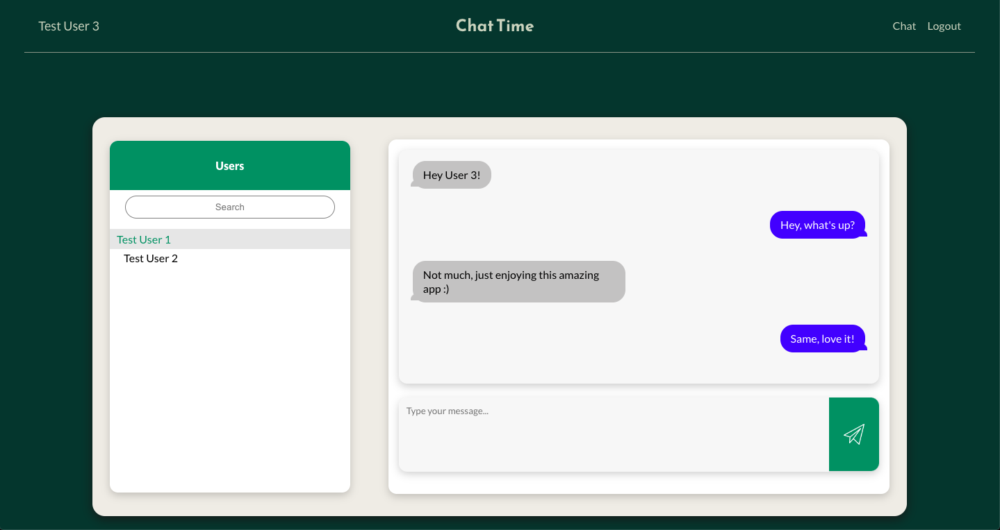
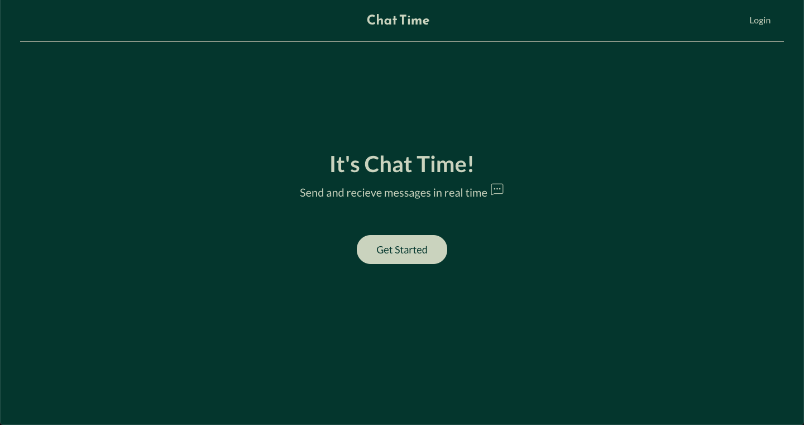
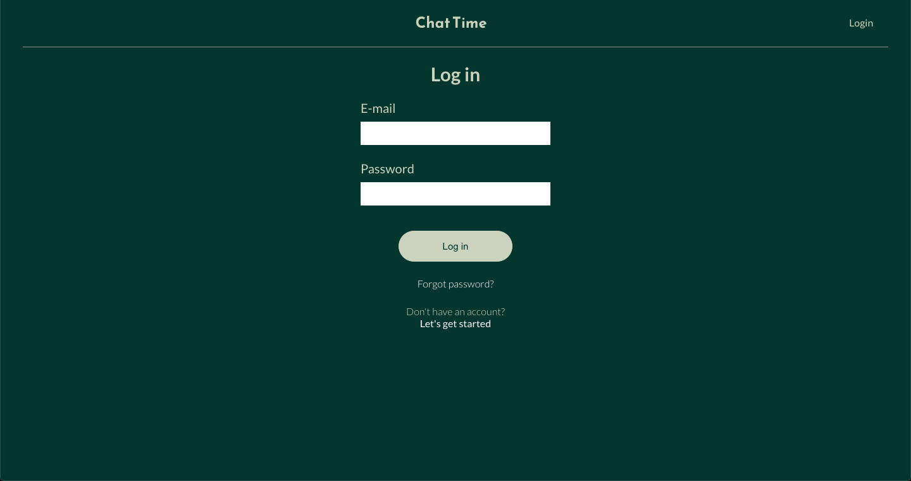
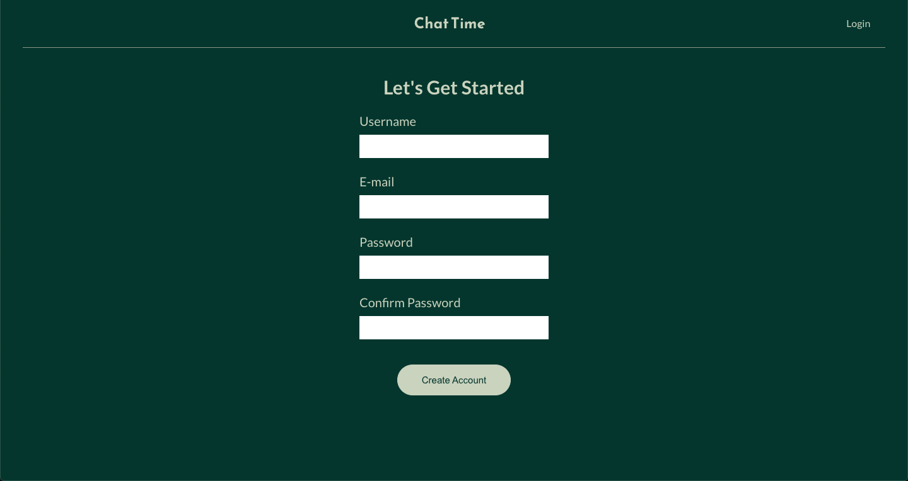
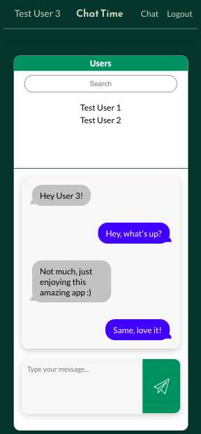

# Chat Time

Chat Time is an instant-messaging app that allows friends and strangers to chat in real time. Built using React, React Router, HTML, CSS, and Firebase.

## Features

### Firebase Authentication
* Register a new account.
* Log in with an existing account.
* Log out of an account.
* User authentication.
* Error handling.

### Chat With a Friend
* View a list of all registered users.
* Select a user to chat with.
* Send and recieve messages in real time.

## Final Product

#### <h3>Chatting with another registered user:</h3>

#### <h3>Homepage:</h3>

#### <h3>Logging in:</h3>

#### <h3>Signing up:</h3>

#### <h3>Mobile view:</h3>

## Getting Started

In the project directory, you can run:

### `npm install`
Installs all the dependencies required for the app to run.

### `npm start`

Runs the app in the development mode.
Open [http://localhost:3000](http://localhost:3000) to view it in your browser.

